<!-- PROJECT LOGO -->
<br />
<div align="center">
  <a href="https://github.com/msu-denver/project-02-a-data-driven-android-application-lab01-group-33">
    <h1>APP+</h1>
  </a>
  <h3 align="center">News and Weather Application Built in Kotlin 💻</h3>
  <h6>( Requirements: Implement Retrofit, Moshi, Glide and RecyclerView )</h6>
  <h6>( and create something cool! )</h6>
</div> 

<div align="center">
    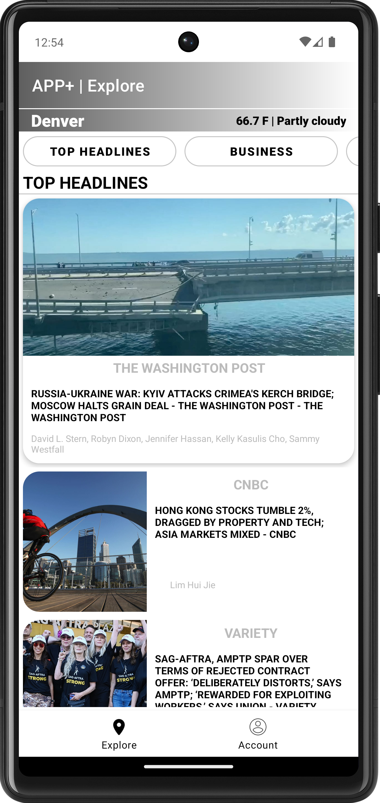
    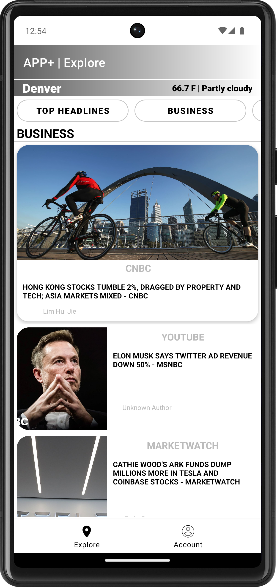
    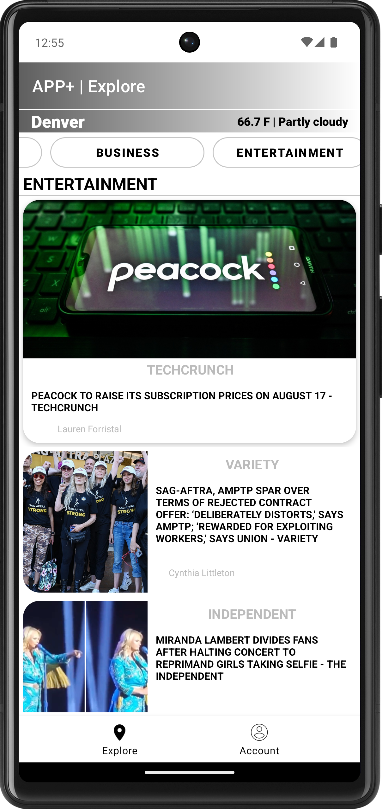
    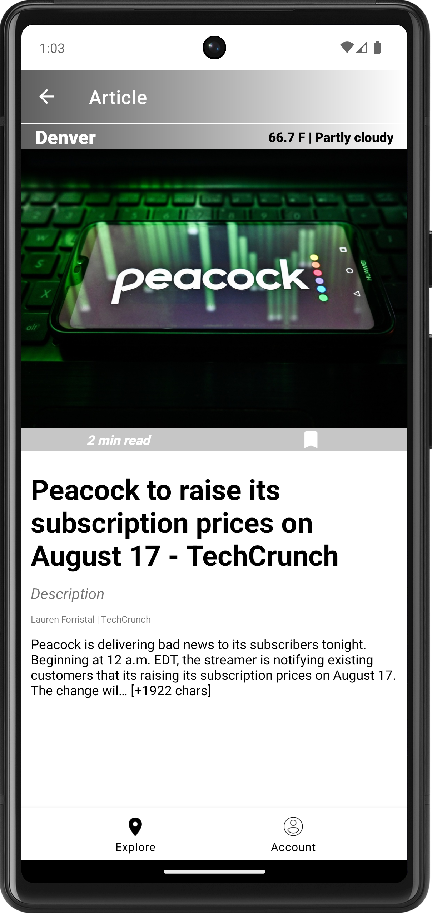
    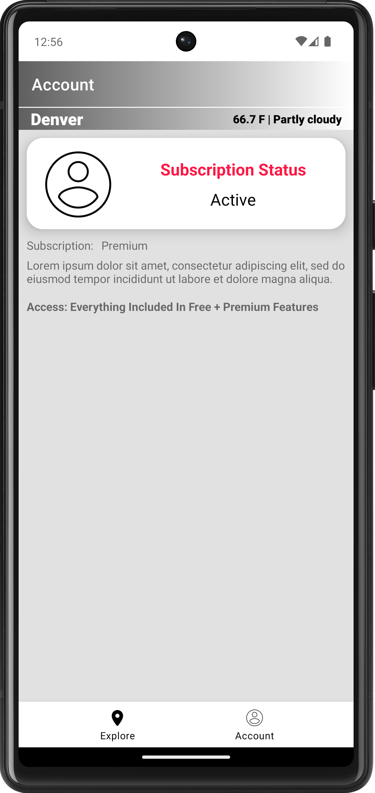
</div>  

<h2 align="center">Swipe Functionality For Cards In RecycleView</h2>

<div align="center">
    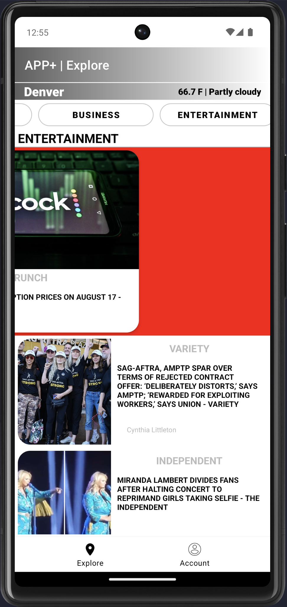
    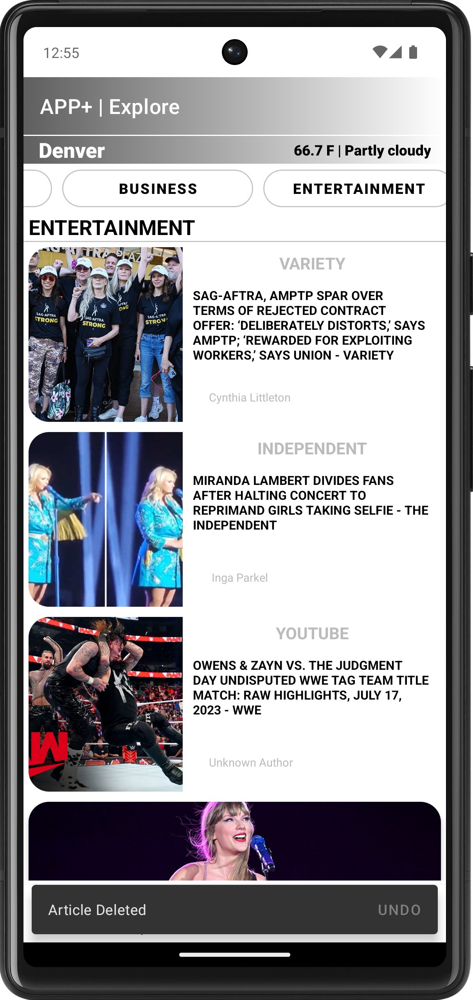
    <br>
    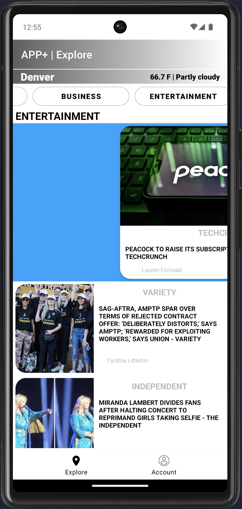
    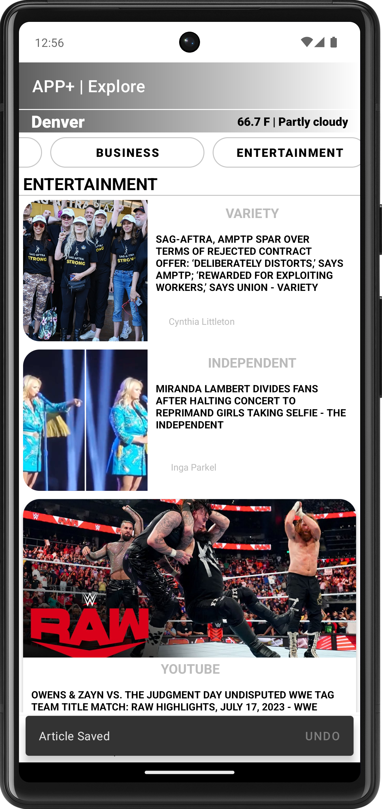

</div>  

<a name="navigate-to-top"></a>

<!-- TABLE OF CONTENTS -->
<details>
  <summary>Table of Contents</summary>
  <ol>
    <li><a href="#about-this-application">About The Project</a></li> 
    <li><a href="#built-with">Built With</a></li>
    <li><a href="#apis">APIs Used</a></li>
    <li><a href="#prerequisites">Getting Setup</a></li>
    <li><a href="#installation">Installation</a></li>
    <li><a href="#how-to-use-this-application">How To Use This Application</a></li>
    <li><a href="#home-fragment">Home Fragment</a></li>
    <li><a href="#weather-fragment">Weather Fragment</a></li>
    <li><a href="#categories-component">Categories (Filter)</a></li>
    <li><a href="#swipe-and-undo-functionality-for-recyclerview-items">Swipe Functionality for RecyclerViewer</a></li>
    <li><a href="#account-fragment">Account Fragment</a></li>
    <li><a href="#contact">Contact</a></li>
    <li><a href="#errors">Errors</a></li>
    <li><a href="#acknowledgements">Acknowledgements</a></li>
  </ol>
</details>

--- 

## ABOUT THIS APPLICATION 
### (Click to expand)

<details>
    My application is called App+, and it’s a simple news application that will allow a user to browse top headlines from various news sources. This application takes inspiration from popular platforms like Apple and Google News and was designed using Figma. I decided its primary purpose would be to help users stay informed about the daily events shaping the our world. This app would allow users to view and filter content amongst various news sources, while also allowing the user to navigate seamlessly through different screens using jetpack navigation to dynamically access other pieces of content throughout various sections of the app. The app was built using Kotlin and Android Studio, and it utilizes Retrofit, Moshi, and Glide to fetch and dynamically display data from the <b><a href="https://newsapi.org/docs">NewsAPI</a></b> and <b><a href="https://www.weatherapi.com/docs/">WeatherAP</a></b>. Given that the requirement was to reuse certain elements of project 01, I decided to continue to expand upon the idea of developing a multi-purpose news application for project 02. My goal for this application is to bridge knowledge gaps about significant changes happening globally and locally, which could prove to be extremely useful for investors, small startups, news enthusiasts, or those who simply have an interest in learning more about whats happening in the world around them.
</details>

## Built With

* ##### KOTLIN - (Programming Language)
* ##### JETPACK - (Navigation)
* ##### ANDROID STUDIO - (IDE)
* ##### RETROFIT - (API Calls)
* ##### MOSHI - (JSON Parsing)
* ##### GLIDE - (Image Loading)

<p align="right">(<a href="#navigate-to-top">back to top</a>)</p>

---

## APIs
### APIs Used (Documentation):
  *  ##### NEWS API - (https://newsapi.org/docs)
  * ##### WEATHER API - (https://www.weatherapi.com/docs/)

<p align="right">(<a href="#navigate-to-top">back to top</a>)</p>

---

# 👋🏾 Getting Setup Locally

## Prerequisites

To get your program up and running properly you will need to install the following software:

* Android Studio
  ```sh
  https://developer.android.com/studio
  ```
* Android SDK
  ```sh
  https://developer.android.com/studio
    ```


<p align="right">(<a href="#navigate-to-top">back to top</a>)</p>

---

## Installation

_Below is an example of how you can instruct your audience on installing and setting up your app.
This template doesn't rely on any external dependencies or services._

1. Clone the repo
   ```sh
   git clone https://github.com/<USERNAME>_/<PROJECT-NAME>.git
   ``` 
2. Open the project in Android Studio
   ```sh
    File -> Open -> Select the project folder
    ```
3. Sync project with gradle files
4. Run the project
5. Enjoy!

<p align="right">(<a href="#navigate-to-top">back to top</a>)</p>

---

## HOW TO USE THIS APPLICATION

## HOME FRAGMENT
#### - Requirements Completed: Utilize Retrofit, Moshi, Glide and RecycleView

Starting from the home fragment, the user is presented with a list of top headlines from various news sources. This list is displayed using a RecycleView, which is populated using Retrofit to make the http request to get the response back. This response is then parsed using Moshi and Glide for any images that need to be loaded and displayed to the user. To view the content of an article the data is passed between fragments using arguments, which presents the user with the articles content displayed from API response (i.e. header, image, article description and main content).

<div align="center">
    
    &nbsp;
    
</div>

Jetpack Navigation is responsible navigating between each of the fragments. This navigation was also implemented within bottom navigation menu to the allow users to switch between the home and account fragments.

<p align="right">(<a href="#navigate-to-top">back to top</a>)</p>

Code snippet for setting up Retrofit and Moshi: 
```
    private val retrofitNews by lazy {
        Retrofit.Builder()
            .baseUrl("https://newsapi.org/v2/")
            .addConverterFactory(MoshiConverterFactory.create())
            .build()
    }
    private val theNewsAPIService by lazy {
        retrofitNews.create(NewsApiService::class.java)
    }
```
Code snippet for obtaining the response from API call:
```
        private fun getNews(category: String) {
        val call = theNewsAPIService.getTopHeadlines(API_KEY, COUNTRY, category)
        call.enqueue(object : Callback<NewsResponse> {
            override fun onFailure(call: Call<NewsResponse>, t: Throwable) {
                handlErrorsWithApi("Failed to get search results")
            }
            override fun onResponse(call: Call<NewsResponse>, res: Response<NewsResponse>) {
                when {
                    res.isSuccessful -> res.body()?.let { newsResponse ->
                        getNewsList(newsResponse)
                    } ?: handlErrorsWithApi("Error...Failed to get search results")

                    else -> {
                        val errorMsg = res.errorBody()?.string().orEmpty()
                        handlErrorsWithApi("Failed to get search results: $errorMsg")
                    }
                }
            }
        })
    }
```

---

## WEATHER FRAGMENT

To add to the overall users experience I decided to implement a weather bar at the top of the home fragment using a custom view. I decided to host both the weather and news fragments within a single activity, where the user is constantly presented with the weather conditions at the top of the screen regardless of the content or fragment they navigate to. This fragment utilizes the WeatherAPI to make the http request to receive a response back, which is then parsed using Moshi and Retrofit. The response is formatted to displayed the name of city, current temperature and weather conditions, which is updated dynamically.

<div align="center">
    
</div>

<p align="right">(<a href="#navigate-to-top">back to top</a>)</p>

---

## CATEGORIES COMPONENT

Upon first glance the user is presented with a way to filter out the content they are viewing by selecting a category from **scrollView** positioned below the weather fragment. This component leverages the same function that makes the http request to get the top headlines, but it passes in a category as a parameter. This allows the user to **dynamically** filter out the content they are viewing based on the category they selected. When the user selects the category they are interested in, the button text is used to pass the category as an argument to the function that makes the http request. This allows the user to dynamically filter out the content they are viewing based on the category they selected.

<div align="center">
    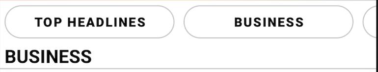
    <br>
    <br>
    
</div>

<p align="right">(<a href="#navigate-to-top">back to top</a>)</p>

Code snippet for dynamically filtering out content based on category selection:
```
 private fun categorySelection(button: MaterialButton, view: View) {
        val category = when (button.id) {
            R.id.top_headlines -> {
                view.findViewById<TextView>(R.id.header_text).text = "Top Headlines".uppercase()
                CATEGORY_DEFAULT
            }
            R.id.business_button, R.id.entertainment_button -> {
                view.findViewById<TextView>(R.id.header_text).text =
                    button.text.toString().uppercase()
                button.text.toString().lowercase()
            }

            else -> CATEGORY_DEFAULT
        }
        getNews(category)
    }
```

---

## SWIPE AND UNDO FUNCTIONALITY FOR RECYCLERVIEW ITEMS
#### SAVE TO SAVE CONTENT

To improve the users engagement with the app I decided to add in TouchHelper support to allow the user to swipe left or right to save or delete an article. This functionality is implemented using a RecycleView, which is populated using Retrofit which makes the http request and displays the content based on the NewsUiModel to once receiving a **_ok_** response back. With TouchHelper implemented the user can can engage more with the content being displayed dynamically on their screen.

<div align="center">
    
    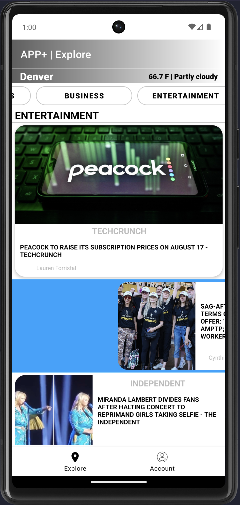
    
</div>

#### SAVE TO DELETE CONTENT

<div align="center">
    
    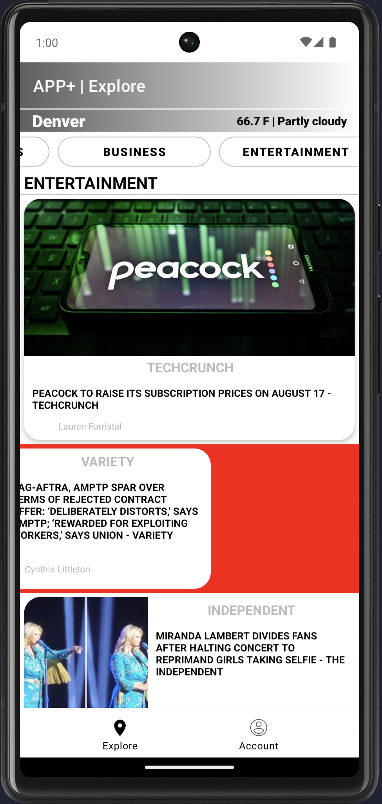
    
</div>

<p align="right">(<a href="#navigate-to-top">back to top</a>)</p>

---
## ACCOUNT FRAGMENT

The user is able to navigate using the bottom navigation menu (jetpack navigation) to the account fragment. This fragment is responsible for displaying the users subscription status and other details regarding their membership to APP+.

<div align="center">
    
</div>

<p align="right">(<a href="#navigate-to-top">back to top</a>)</p>

---

## LOADING DIALOG

APP+ also features a loading dialog that appears as news articles are fetched from the API. This dialog is displayed using a custom view, which is displayed when the user selects a category from the categories component. This dialog is displayed until the response is received back from the API, which is then parsed using Moshi and displayed to the user.

<div align="center">
    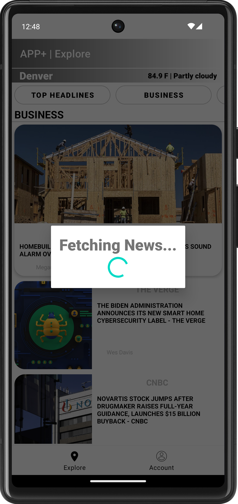
</div>

<p align="right">(<a href="#navigate-to-top">back to top</a>)</p>

Code snippet for creating and displaying a loading dialog when making for http request:
```
    private fun showLoadDialog() {
        // Create a new instance of the loading dialog
        loadingDialog = Dialog(requireContext())
        loadingDialog?.setContentView(R.layout.loading)
        loadingDialog?.setCancelable(false)
        loadingDialog?.show()
    }
```

---

## Contact
Name:  William Hellems-Moody
<br>
Project
Link: [https://github.com/willMoody/project-02](https://github.com/msu-denver/project-02-a-data-driven-android-application-lab01-group-33)

<p align="right">(<a href="#navigate-to-top">back to top</a>)</p>

---

## Errors

If program is not running after compiling, try the following:

1. Clean Project
2. Rebuild Project
3. Invalidate Caches/Restart
4. Sync Project with Gradle Files
5. Restart Android Studio
6. Restart Computer
7. Reinstall Android Studio

---
<div align="center">

</div>
Upon getting the following error related to iCloud, repeat the steps above or try the following:

1. Find the duplicate file in the project directory
2. Delete the duplicate file
3. Clean Project
4. Rebuild Project
5. Invalidate Caches/Restart
6. Sync Project with Gradle Files
7. Rerun Project
8. Enjoy!

<p align="right">(<a href="#navigate-to-top">back to top</a>)</p>

---

## Acknowledgments

* [GitHub Copilot](https://github.com/features/copilot/)
* [Android Developer Guides](https://developer.android.com/guide)
* [Android Basics in Kotlin](https://developer.android.com/courses/android-basics-kotlin/course)
* [Figma](https://www.figma.com)

---
## API Sources
* [NewsAPI | Documentation](https://newsapi.org/docs)
* [WeatherAPI | Documentation](https://www.weatherapi.com/docs/)

<p align="right">(<a href="#navigate-to-top">back to top</a>)</p>

---
